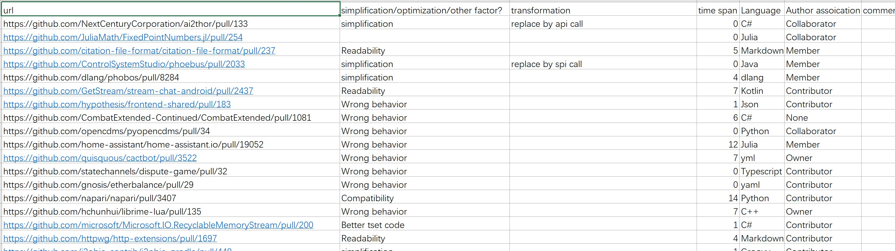
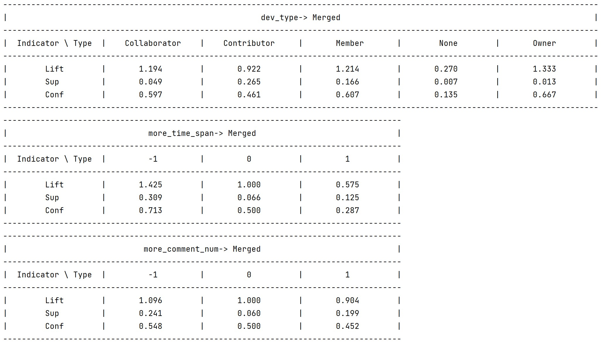

# Multiple PRs

## Intro

This is the repository proofing my current work in the research topic, **An Empirical Study of the Selection Benchmarks for Multiple Pull Requests**. The repository includes information about collected multiple requests, thesis proposal and the python project of exploratory analysis.  I will introduce them one by one in the following sections. 

## Data

The excel file, [alternative_prs.xlsx](./data/alternative_prs.xlsx), contains more than 300 groups of multiple requests. In the excel file, each row contains information about url, selection benchmark,  time span, language, author association, the number of comments, the number of review comments, the number of commits, the number of deleted lines, the number of added lines and the number of changed files. Here is a screenshot of the excel file.  

## PrAnalyzer

 I wrote codes and did some exploratory work in analyze task. There is a project analyzing the relationships between merge decision and features of multiple requests. In the project, I select lift, support and confidence as indicators. The [page](https://www.thedataschool.co.uk/liu-zhang/understanding-lift-for-market-basket-analysis) introduces these indicators. Here is the screenshot of partial output of my project. Additionally, in the [thesis proposal](./Proposal/thesis_proposal.pdf), I briefly demonstrated how I will complete the analyze task by using point-biserial correlation coefficient, odds-ratio, Pearson’s chi-square test, and Cramér's V. 

## Proposal

The [thesis proposal](./Proposal/thesis_proposal.pdf) reveals the whole plan of my research. The original version of the thesis proposal is in Chinese but I translated it into English version. In the translated thesis proposal, you can see how I will plan to study, design, and carry out my research.

## Postscript

Because of some reason I explained in my statement of purpose or personal statement, after prolong and cautious consideration, I dropped out of the Southern University of Science and Technology on my own initiative in November, 2022. Therefore, I was no longer responsible for the research.
